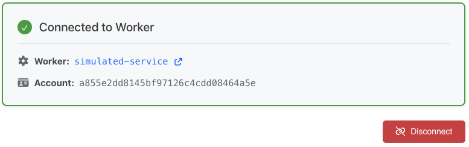

# Workers HMD

Workers Health Mediated Deployments (HMD) is a system that facilitates the staged, gradual rollout of new Workers [versions](https://developers.cloudflare.com/workers/configuration/versions-and-deployments/) to production. It integrates directly with [Workers Observability](https://developers.cloudflare.com/workers/observability/) for health metrics.

[](https://deploy.workers.cloudflare.com/?url=https://github.com/markjmiller/workers-hmd)


## Without HMD

The manual way to do this is to…
1. Create a new Worker version
2. Create a new deployment with something like 90% vCurrent and 10% vNew
3. Monitor health metrics for a time period then decide to progress or cancel the deployment (and then revert to 100% vCurrent) 
4. Then increment the deployment percent by a little bit and repeat
5. Keep incrementing until you reach 100%, each time waiting and monitoring

So tedious… this should be automated!

## HMD for Workers

Here's how the feature works:
1. **Release Definition**: users define a release plan with…
  * [Service Level Objectives](https://sre.google/sre-book/service-level-objectives/) (SLOs) based on Service Level Indicators (SLIs) sourced from Workers Observability
  * Customizable stages that define…
    * % rollout
    * Soak time
    * Whether the stage progresses manually or automatically
2. **Version Creation**: To initiate a production release, users create a new Worker version. By default, this has 0% traffic routed to it.
3. **Release Start**: Users then start a release, which is an instance of the release plan. Each stage in the plan progressively increases the percentage of traffic directed from the current Worker version to the new one. For example, a release might consist of stages at 0%, 25%, 50%, 75%, and 100% rollout.
4. **Staged Rollout with Soak Periods**: Within each stage, a soak period begins. During this time, the system continuously monitors SLOs.
5. **Progression and Failing**:
  * If the soak period completes without any SLO violations, the stage can either be manually or automatically progressed to the next stage, increasing the traffic to the new Worker version.
  * Crucially, if an SLO is violated at any point, the rollout automatically aborts. The deployment is immediately reverted to 100% of the old Worker version, and the new version receives 0% of the traffic.
6. **Completion**: If all stages successfully pass without SLO violations, the new Worker version reached 100% deployment, meaning all production traffic is now routed to it. At this point, the release is considered complete.

## Instructions

### 1. Connect your Worker

- [Find your account id](https://developers.cloudflare.com/fundamentals/account/find-account-and-zone-ids/)
- [Get your API token](https://developers.cloudflare.com/fundamentals/api/get-started/create-token/)


Then you should see...



### 2. Create a release plan

Set polling rate and SLOs:


Configure stages (and don't forget to hit save!):


### 3. Start a release

Select which Workers versions you want to roll out to.


Then click create release! You'll get live updates of your release progress:


You can approve or deny stages that aren't set to "Auto Progress":


In the Cloudflare dashboard you can see your deployments being actioned:


### 4. See history and why releases failed


Or a successful deployment!


## Architecture

- [Cloudflare Workers](https://developers.cloudflare.com/workers/) and [vite](https://vite.dev/)
- [Durable Objects](https://developers.cloudflare.com/workers/durable-objects/) for all app state
- [Workflows](https://developers.cloudflare.com/workers/workflows/) to power the release stages
- [Workers Observability](https://developers.cloudflare.com/workers/observability/) to get health metrics
- One project with no infrastructure dependencies and a single deploy command!

## Dev

| Command | Description |
|---------|-----------|
| `npm run dev` | **Start development server** - Most commonly used for local development |
| `npm run deploy` | **Deploy to Cloudflare** - Push your changes to production |
| `npm run build` | **Build for production** - Compile TypeScript, bundle assets, and generate API docs |
| `npm run check` | **Pre-deployment validation** - Verify code compiles and deployment readiness |
| `npm run lint` | **Format code** - Auto-format source code with Prettier |
| `npm run preview` | **Preview built app** - Test the production build locally |
| `npm run generate-types` | **Generate TypeScript types** - Run when OpenAPI schema is modified |
| `npm run cf-typegen` | **Generate Worker types** - Run when new Cloudflare bindings are added |
| `npm run lint-openapi` | **Validate OpenAPI schema** - Check API documentation for errors |
| `npm run preview-openapi` | **Preview API docs** - View OpenAPI documentation in browser |

### Debugging

Useful logs for seeing exactly what's happening. Just call `npx wrangler tail`!

```
🚀 Starting release: dff05d56
----------
Worker Name: simulated-service
Account ID: c855e2dd8145bf97126b4cdd08464a5a
----------

🎬 Starting stage 1: 600s soak

=== CF DEPLOYMENT API REQUEST ===
Account: c855e2dd8145bf97126b4cdd08464a5a
Worker: simulated-service
Old Version: e591e866-cd70-4d35-b5b3-c652bb7259e3 (90%)
New Version: 14715573-1e39-4a3d-b7cf-f778a1a4fcca (10%)
================================

🛁 Stage 1 soak - Checking SLOs

=== Observability ===
P999 Wall: 893
P99 Wall: 251
P90 Wall: 65
P50 Wall: 43
=====================

📊 SLO Evaluation: All 2 SLO(s) passed

✅ Stage 1 soak passed - All SLOs satisfied

🛁 Stage 1 soak - Checking SLOs

=== Observability ===
P999 Wall: 899
P99 Wall: 231
P90 Wall: 68
P50 Wall: 42
=====================      

📊 SLO Evaluation: All 2 SLO(s) passed

✅ Stage 1 soak passed - All SLOs satisfied

🛁 Stage 1 soak completed

✅ Stage 1 completed

🎬 Starting stage 2: 600s soak
```

## Simulation

Here's a simple Worker and script you can run to simulate unhealthy SLOs. The `rate=100` url param will cause 1 in 100 requests to have a large latency. Uncomment the 500 error line to simulate 500 errors. Set iterations to something like ten thousand or a million to just keep it running during an HMD release.

```bash
export cf_account_id="replace-me"
export cf_api_token="replace-me"
export cf_subdomain="replace-me"

curl "https://api.cloudflare.com/client/v4/accounts/$cf_account_id/workers/scripts/simulated-service" \
  -X PUT \
  -H "Authorization: Bearer $cf_api_token" \
  -F "metadata={
        \"main_module\": \"simulated-service.mjs\",
        \"compatibility_date\": \"2025-07-24\",
        \"observability\": {
          \"enabled\": true
        }
      };type=application/json" \
  -F "simulated-service.mjs=@-;filename=simulated-service.mjs;type=application/javascript+module" <<EOF
export default {
  async fetch(request, env, ctx) {
    let url = new URL(request.url);
    let rate = url.searchParams.get('rate') ?? 100;
    const randomNumber = Math.floor(Math.random() * rate);
    // Simulate latencies
    if (randomNumber == 0) {
      await new Promise(resolve => setTimeout(resolve, 1000 + Math.floor(Math.random() * 200)));
      // return new Response("Simulated 500 error", { status: 500 });
    } else {
      await new Promise(resolve => setTimeout(resolve, 10 + Math.floor(Math.random() * 20)));
    }
    return new Response("Hello world!", { status: 200 });
  }
};
EOF

curl "https://api.cloudflare.com/client/v4/accounts/$cf_account_id/workers/scripts/simulated-service/subdomain" \
  -X POST \
  -H "Authorization: Bearer $cf_api_token" \
  -H "Content-Type: application/json" \
  -d '{"enabled": true}'
```

```bash
#!/bin/bash

URL="https://simulated-service.$cf_subdomain.workers.dev?rate=10"
ITERATIONS=1000

# Create temporary file to store results
TEMP_FILE=$(mktemp)
trap 'rm -f "$TEMP_FILE"' EXIT

echo "CURLING $URL $ITERATIONS times..."

# Function to make a request and log the result
make_request() {
  local i=$1
  http_code=$(curl -s -o /dev/null -w "%{http_code}" "$URL")
  echo "$http_code" >> "$TEMP_FILE"
  
  if [ $((i % 100)) -eq 0 ]; then
      echo "  Processed $i of $ITERATIONS requests..."
  fi
}

# Disable job control to suppress background job messages
set +m

# Run requests with max 2 parallel processes
for i in $(seq 1 $ITERATIONS); do
  make_request $i &
  
  # Limit to 2 background processes
  if [ $((i % 2)) -eq 0 ]; then
    wait
  fi
done

# Wait for any remaining background processes
wait

echo ""
echo "--- Results ---"
# Count and display results
sort "$TEMP_FILE" | uniq -c | while read count code; do
  echo "HTTP Status $code: $count times"
done
```
